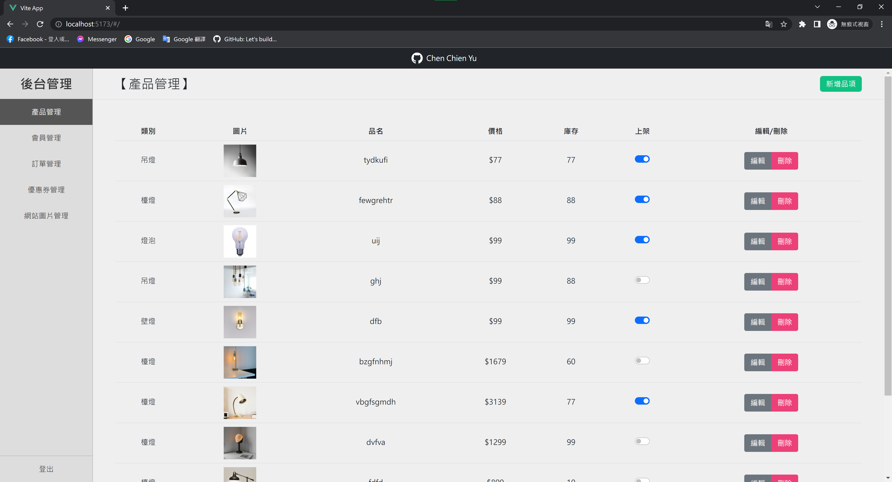

# 自製後台管理系統




<br>

### 尚未製作頁面暫時以此畫面顯示↓


***

## 使用技術、套件

|  技術/套件   | 簡述  |
| :----- | :----- |
| Vue vite   | 以 Vue.js 開發 SPA 網站 |
| VueRouter  | 設定路由 |
| Pinia  | 數據共享 |
| Bootstrap 5  | 格線系統使用、開發 UI 介面元件使用 |
|axios|串接後端資料|
|Node.js / express| 撰寫 API提供前端串接資料 |
|Firebase Cloud Firestore |儲存資料|
|Firebase Storage |儲存圖片|
***

## 使用方法
```javascript
// 下載後開啟終端機執行
npm install
```

```javascript
// 開啟前端server
npm run dev
```

```javascript
// 開新終端機 移至server資料夾
cd server
```
```javascript
// 開啟後端server
node server.js
```
